# petit-talk

"Petit Talk" is built using Django, Python, JavaScript, HTML, CSS, Stripe and PostgreSQL. It is hosted on Heroku.

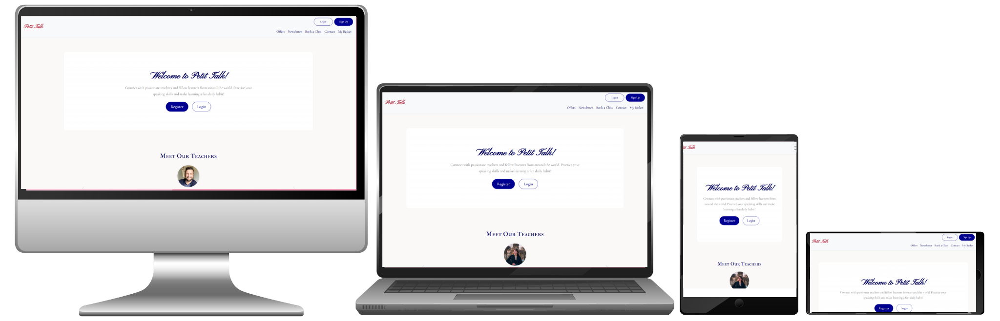

To visit the deployed version of Petit Talk : [click here.](https://petit-talk-ca40a73c8b94.herokuapp.com/)

## Table of Contents

1. [Purpose](#1-purpose)
2. [Business Goals & Strategy](#2-business-goals--strategy)
3. [Features](#3-features)
4. [Planning](#4-planning)
     - 4.1. [User Stories](#41-user-stories)
     - 4.2. [Epics](#42-epics)
     - 4.3. [Sprints](#43-sprints)
     - 4.4. [Database Diagram](#44-database-diagram)
     - 4.5. [Project Structure](#45-project-structure)
     - 4.6. [App Overview & Responsibilities](#46-app-overview--responsibilities)
5. [Testing](#5-testing)
     - 5.1 [Validators and Linters](#51-validators-and-linters)
     - 5.2 [Automated Tests](#52-automated-tests)
     - 5.3 [Manual Tests](#53-manual-tests)
     - 5.4 [Responsiveness & Accessibility](#54-responsiveness--accessibility)
6. [E-Commerce Implementation](#6-e-commerce-implementation)
     - 6.1 [E-Commerce Business Model](#61-e-commerce-business-model)
     - 6.2 [Payment System & Stripe Integration](#62-payment-system--stripe-integration)
Products & Models
Payment Integration
CRUD Functionality
Forms & Validation
Feedback & Notifications
7. [Authentification & Role-Based Authorization](#7-authentification--role-based-authorisation)
8. [SEO & Marketing](#8-seo--marketting)
     - 8.1. [Target Audience](#81-target-audience)
     - 8.2. [Platforms for Engagement](#82-platforms-for-engagement)
     - 8.3. [User Needs and Content Strategy](#83-user-needs-and-content-strategy)
     - 8.4. [Sales and Promotions](#84-sales-and-promotions)
     - 8.5 [Marketting Goals and Supporting Strategies](#85-marketting-goals-and-supporting-strategies)
     - 8.6 [SEO Techniques](#86-seo-techniques)
9. [Deployment & Setup](#9-deployment--setup)
10. [Development](#10-development)
11. [Bugs & Challenges Encountered](#10-bugs--challenges-encountered)
12. [Credits](#11-credits)

## 1. Purpose

Petit Talk is an online French learning platform that connects students with native French speakers. The service allows students to improve their pronunciation, learn authentic French, and interact with real teachers through live sessions. The application includes a secure booking system, integrated payment system, special offers, a newsletter signup, teacher and student profiles, and the option for students to leave feedback.

Teachers can accept or decline bookings, while administrators manage teachers, subscriptions, offers, newsletters, and bookings through a secure role-based dashboard. The full-stack web application ensures a safe, seamless, and responsive experience for all users.

Project Goals:
- Provide a seamless, responsive booking and payment experience for students.
- Prevent scheduling conflicts through time-slot management for teachers and students.
- Ensure secure payment processing for all transactions.
- Offer students a personalized dashboard to view, manage, and track their bookings and payment basket.
- Enable teachers to manage their availability, accept or decline bookings, and interact with students.
- Allow administrators to manage teachers, offers, subscriptions, newsletters, and bookings efficiently.
- Deliver a consistent, user-friendly interface that reflects a professional and engaging educational platform.

Target Audience:
- English-speaking students seeking to learn French from native speakers.
- Learners looking for interactive, personalized, and authentic language learning experiences.

## 2. Business Goals & Strategy
- Goal 1: Attract New Users
Strategy: Awareness through social media, SEO, and shareable content.
Tactics: Instagram reels, Facebook ads, SEO blog posts.
- Goal 2: Convert Visitors into Paying Students
Strategy: Strong calls-to-action and clear offers.
Tactics: Bundle deals, landing pages, email nurture sequences.
- Goal 3: Retain Customers
Strategy: Loyalty programs and consistent engagement.
Tactics: Newsletters, repeat-purchase discounts, referral programs.
- Goal 4: Build Brand Identity
Strategy: Leverage authenticity, French culture, and teacher/student stories.
Tactics: Consistent branding, behind-the-scenes content, social media storytelling.

## 3. Features

## 4. Planning
### 4.1 User Stories
All user stories are documented in the Agile tool linked to this project. Each story includes detailed acceptance criteria and associated tasks. There are 29 user stories and 7 epics in total on the project board, and all have been completed. All of them are connected to an Epic and a Sprint on the board and in this document.
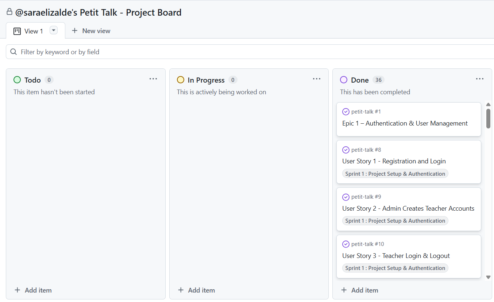
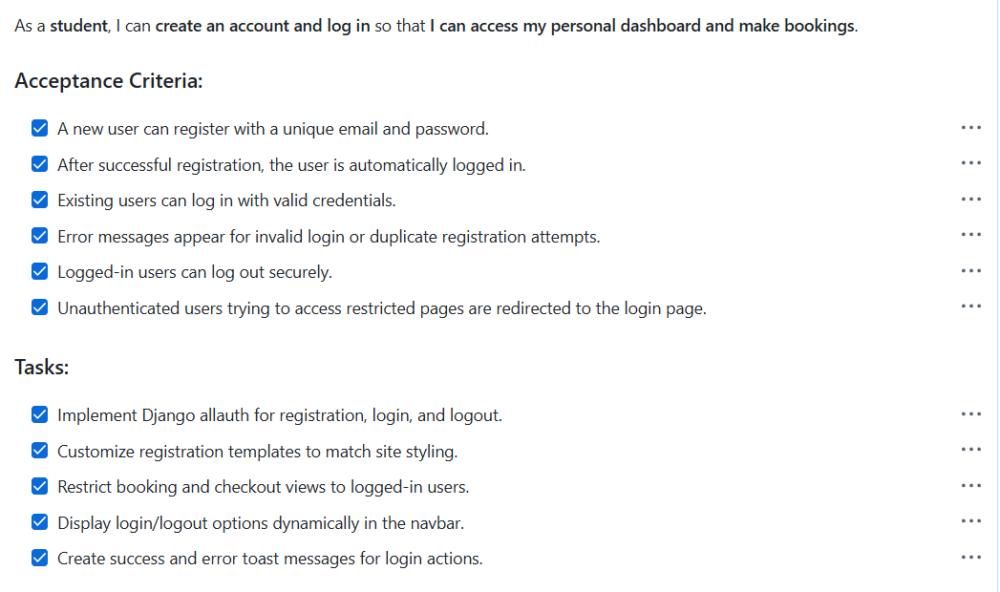
### 4.2 Epics
Seven epics were created to organize and plan this project:

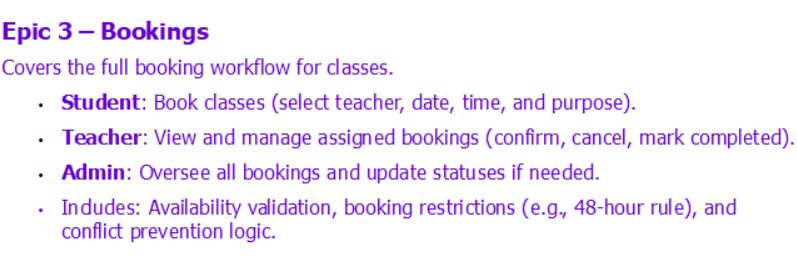

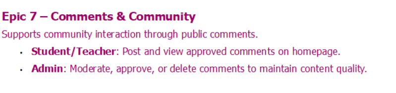
### 4.3 Sprints
Four Sprints were created to organize and plan this project:
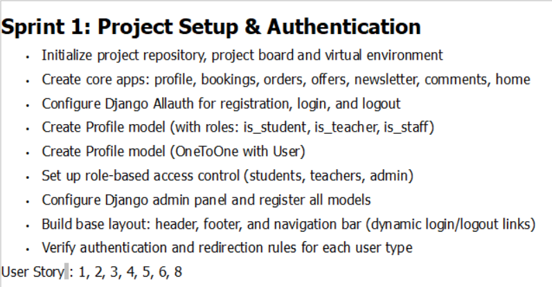

### 4.4 Database Diagram
To plan the relationships between my models, I created the following database diagram.
 - User (Django built-in)
 
 - Profile Model
 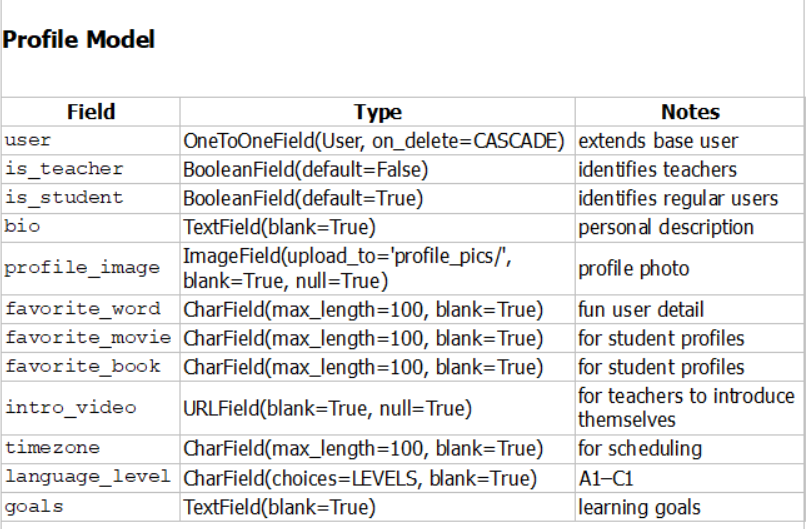
 - Booking Model
 
 - Order Model
 
 - Offer Model
 
 - Newsletter Model
 
- Comment Model
 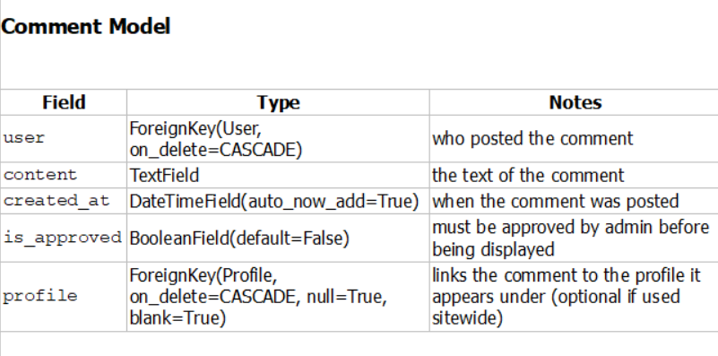
- Models Relationship
 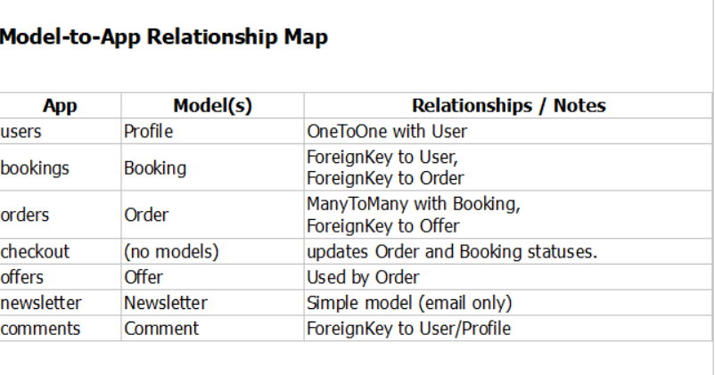
### 4.5 Project Structure
The project was initially organized to maintain a clear and scalable folder structure. Some changes were made during development, such as renaming files and adding new templates.

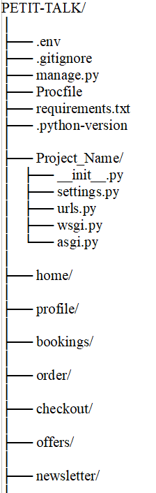
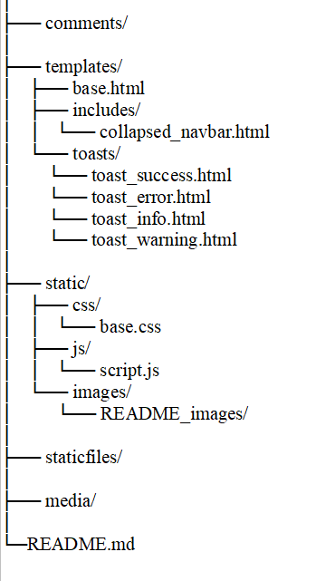
### 4.6 App Overview & Responsibilities
#### Home App:
- Purpose:
Serves as the public-facing entry point of the website.
- Responsibilities:
Displays the homepage with hero banner, introduction, and featured offers.
Provides navigation links to other sections (Bookings, Offers, Contact, Login/Register).
Contains general static pages (About, Terms, etc.) if needed.
#### Profile App
- Purpose:
Manages user profiles and account-related pages.
- Responsibilities:
Extends Django’s built-in authentication system.
Provides profile page with editable information (photo, learning goals, language level, timezone).
Handles user dashboard displaying past and upcoming bookings.
Handle role-based profile views (teacher/student/admin)
Let teachers manage availability
#### Bookings App
- Purpose:
Handles all logic related to class scheduling and management.
- Responsibilities:
Allows users to select class date, time, level, and purpose.
Stores and manages bookings linked to user accounts.
Displays booking details, status (pending/confirmed/completed/cancelled), and teacher assignment.
Integrates with the Order app during checkout to confirm payment.
Handle booking creation per teacher
Check availability based on teacher’s calendar
#### Order App
- Purpose:
Acts as the shopping cart for temporary session-based storage of selected bookings.
- Responsibilities:
Adds, updates, and removes bookings before checkout.
Displays subtotal and dynamically updates totals.
Manages session-based cart data until payment is confirmed.
#### Checkout App
- Purpose:
Processes payments securely and finalizes orders.
- Responsibilities:
Integrates Stripe for online payments.
Handles order creation, confirmation, and Stripe webhook responses.
Updates booking status to “paid” and generates confirmation toast/messages/emails.
Provides order summary and success/failure pages.
#### Offers App
- Purpose:
Manages promotional offers that apply to user orders.
- Responsibilities:
Stores details of active/inactive offers (discount type, value, and description).
Applies valid offers automatically or via code during checkout.
Enables admin control to add, edit, hide, or remove offers dynamically.
#### Newsletter App
- Purpose:
Collects email subscriptions for marketing and communication purposes.
- Responsibilities:
Provides a newsletter signup form in the homepage.
Stores user emails in a simple database model for future campaigns.
Allows admin to manage subscribers through the Django admin interface.
#### Comments app
- Purpose:
Manages user-generated content (comments or posts) displayed on the homepage or profile pages.
- Responsibilities:
Allow users to submit a short message, testimonial, or post.
Require admin approval before being displayed.
Allow admin moderation (approve/delete).
Display approved comments on the homepage or under profile pages.

## 5. Testing
### 5.1 Validators and Linters
- [CI Python Linter](https://pep8ci.herokuapp.com/): Initially found multiple syntax and style issues. All have been resolved.
- [W3C Markup Validator](https://validator.w3.org/): Every errors have been resolved.
- [W3C CSS Validator](https://jigsaw.w3.org/css-validator/): No errors found.
- [JS Hint](https://jshint.com/): No errors found.
- Lighthouse 
A report generated with Chrome Lighthouse showed no major issues with performance or accessibility.
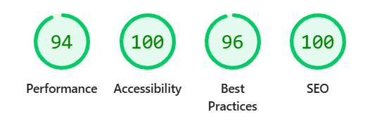
- [XML-Sitemaps.com](https://www.xml-sitemaps.com/validate-xml-sitemap.html) Came back with no issues detected.

### 5.2 Automated Tests
A total of 46 automated tests were written to cover models, views, and forms across both applications.
All tests passed successfully.

### 5.3 Manual Tests
### 5.4 Responsiveness & Accessibility
- Website is responsive on desktop, tablet, and mobile.
- Navbar collapses correctly on smaller screens.
- Text and buttons are readable on all screen sizes.
- Contrast and color choices meet accessibility standards.
- Staff and teachers dashboards are optimized for larger screens. On smaller screens, a horizontal scroll bar appears for the tables to maintain usability without breaking the layout.

- Tested on Chrome DevTools with multiple screen sizes
- The website has been tested on different browsers such as Chrome, Firefox and Safari and all works.

## 6. E-Commerce Implementation
### 6.1 E-Commerce Business Model
Petit Talk generates revenue through online French lessons delivered by native speakers. The business model is structured to provide flexibility for users while maximizing engagement and sales through lesson and promotional offers.
#### Revenue Streams:
- Individual Lessons – Students can purchase lessons for immediate scheduling.
- Lesson Bundles / Packs (Future Implementation) – Packages of 5, 10, or 20 lessons at discounted rates to encourage bulk purchases.
- Promotional Offers – Seasonal discounts, exam prep bundles, and referral bonuses to drive conversions and retain users.
#### Value to Users:
- Flexible scheduling and tailored lesson plans.
- Transparent pricing with bundled discounts for committed learners.
- Access to native French speakers and authentic learning experiences.
- Personalized dashboards to track bookings, payments, and progress.
### 6.2 Payment System & Stripe Integration
Petit Talk uses Stripe to securely process online payments.
Stripe webhooks are implemented to verify whether a payment has succeeded or failed, and all transactions can be monitored through the Stripe Developer Dashboard.
#### Payment Flow:
- Users create one or several bookings, add them to their basket, active offers automatically update the total price and proceed to checkout.
- Form validators ensure that users provide a full name, a valid email address, a country, and a valid card number.
- (Known limitation: the price sometimes displays as 18.0000 instead of 18.00. This is only a formatting issue and does not affect the actual charged amount.)

- A Stripe PaymentIntent is created in Django and returned to the frontend.
- Stripe.js confirms the payment securely using the user’s card details.

- Stripe webhook finalizes the order:
     - Success: A confirmation page is shown, a success message is displayed, and the booking becomes PAID in the student/teacher and admin dashboard.
     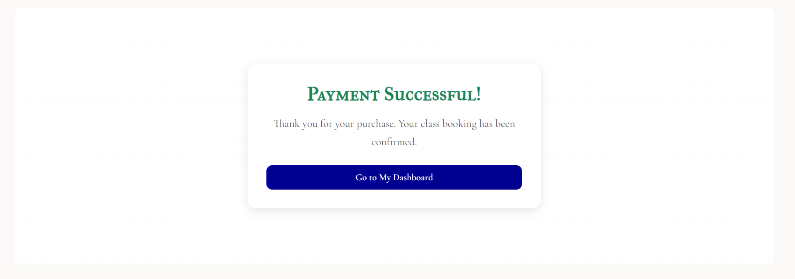
     - Failure: An error message informs the user, and the booking stays UNPAID and in the basket.
     
### Security & Best Practices
- Stripe public and secret keys are securely stored in env.py and in Heroku CONFIG VARS, never in the GitHub repository.
- Any keys that were accidentally pushed to GitHub were IMMEDIATELY REPLACED with new keys both locally and on Heroku.

## 7. Authentification & Role-Based Authorization
The application uses a secure authentication system to manage user access and protect sensitive data. Users can register, log in, and access functionality based on their assigned role (Student, Teacher, or Admin). Role-based authorization ensures that users can only access the features relevant to their role, maintaining privacy, security, and operational integrity.

### Access & Permission:

#### Role Assignment:
Roles are assigned during registration or by admin approval.
- Students are auto-assigned upon signup.
- Teachers are created by the admin in his dashboard, but can update their own profile, upload photo and video.
- Admin accounts are pre-assigned by system setup.
- User Feedback on Access: Unauthorized access attempts are redirected to a safe page such as the homepage.

## 8. SEO & Marketing
### 8.1 Target Audience
The platform is designed for English speakers interested in learning French with a native teacher. Key user groups include:
- Students (Teens & University Level)
Needs: Academic support, exam preparation, improved grades.
Motivations: Passing school requirements, strengthening CVs, preparing for exchange programs.
Approach: Promote affordable lesson packages, flexible scheduling, and the benefit of learning directly with a native speaker.
- Parents of Students
Needs: Reliable and effective tutoring for their children.
Motivations: Supporting academic success.
Approach: Highlight professionalism, safety, and proven results. Showcase structured lesson plans and progress tracking.
- Adult Learners & Professionals
Needs: Language skills for career advancement, relocation, or business travel.
Motivations: Professional development, competitive advantage, international opportunities.
Approach: Position lessons as efficient, tailored, and practical. Present the service as a higher-value investment compared to free apps.
- Travelers & Culture Enthusiasts
Needs: Conversational skills and cultural insights for authentic experiences abroad.
Motivations: Enhancing travel, enjoying French lifestyle and traditions.
Approach: Use aspirational branding (café, Parisian atmosphere). Offer crash courses and cultural content.
- Retirees & Hobby Learners
Needs: Stimulating and enjoyable activity.
Motivations: Lifelong learning, cultural connection, personal enrichment.
Approach: Emphasize fun, community, and learning at a comfortable pace.
Key Differentiator: The “real French teacher” element builds authenticity, credibility, and cultural immersion across all segments.
### 8.2 Platforms for Engagement
- Facebook

Primary Audiences: Parents, retirees, and adult learners (30+).
Why it Works: Strong with older demographics, active parenting and education communities, and precise demographic targeting for ads.
Content Style: Testimonials, structured offers, cultural insights.
- Instagram
Primary Audiences: Students, young adults, travelers, and professionals (16–35).
Why it Works: Visual, aspirational, and lifestyle-driven platform. Strong reach through reels and hashtags.
Content Style: Short lessons, travel phrases, cultural tips, and aspirational French-themed visuals.
### 8.3 User Needs and Content Strategy
- Parents (Facebook)
Needs: Trustworthy support for children’s French classes.
Content: Testimonials, before/after success stories, learning tips.
Delivery: Facebook posts/ads; email newsletters with progress tips and resources.
- Retirees (Facebook)
Needs: Engaging cultural activity and travel preparation.
Content: Simple phrases, cultural spotlights, brain-health stories.
Delivery: Friendly Facebook posts; email “word of the week” campaigns.
- Students (Instagram)
Needs: Exam prep, quick learning, stress relief.
Content: Grammar hacks, vocabulary challenges, humor/memes.
Delivery: Instagram reels, quizzes, and email reminders before exams.
- Travelers (Instagram)
Needs: Practical phrases, cultural etiquette.
Content: Travel-specific reels, visual phrase carousels, mini cultural guides.
Delivery: Instagram posts; downloadable PDF “French Travel Survival Kit” via email signup.
- Professionals (Instagram & Email)
Needs: Efficient career-focused learning.
Content: Business vocabulary, case studies, productivity tips.
Delivery: Instagram carousels; segmented email sequences promoting professional packages.
- Multi-Channel Approach:
Facebook → Trust-building with parents and retirees.
Instagram → Engagement with students, travelers, and professionals.
Email → Nurturing and conversions across all audiences.
### 8.4 Sales and Promotions
- Bundle Offers
Buy 5 lessons, get 1 free.
10-lesson packs at reduced per-unit cost.
Purpose: Encourage commitment and increase retention.
- Seasonal Offers
Exam Prep Bundles (spring/fall).
Travel Crash Courses (summer, holidays).
New Year/Back-to-School Promotions.
- Communication Channels
Parents & Retirees: Facebook posts/ads and email newsletters with clear, trust-building messages.
Students: Instagram reels/stories and exam-season email offers.
Travelers/Young Adults: Instagram visuals and email freebies (phrase guides leading to bundles).
- Timing Strategy
Exam seasons: Focus on Instagram + email for students.
Travel seasons: Emphasize Instagram aspirational posts + follow-up emails.
Year-round: Keep bundle promotions active on Facebook and within email drip campaigns.
### 8.5 Marketting Goals and Supporting Strategies
- Goal 1: Attract New Users
Strategy: Increase brand awareness through shareable content and targeted advertising.
Tactics: Instagram reels showcasing lessons, Facebook ads targeted to relevant audiences, SEO-optimized blog posts on learning French.
KPIs: Reach, impressions, website visits from social channels.
- Goal 2: Convert Visitors into Paying Students
Strategy: Encourage sign-ups with clear offers and strong calls-to-action.
Tactics: Bundle deals, dedicated landing pages for special offers, email nurture sequences highlighting teacher expertise and testimonials.
KPIs: Sign-ups, checkout conversions, coupon redemptions.
- Goal 3: Retain Customers
Strategy: Build loyalty through consistent value, engagement, and rewards.
Tactics: Newsletter campaigns, repeat-purchase discounts, referral programs, push notifications for upcoming classes.
KPIs: Repeat bookings, newsletter open rates, referral conversions.
- Goal 4: Build Brand Identity
Strategy: Leverage authenticity, cultural appeal, and teacher/student stories.
Tactics: Consistent French-inspired branding across website and socials, behind-the-scenes content, teacher/student spotlight reels and stories.
KPIs: Engagement (likes, shares, comments), brand recall metrics, social media followers growth.
- Channel Focus:
Facebook: Target parents and older audiences — longer, trust-building content.
Instagram: Target students, travelers, professionals — short, aspirational content.
Email: Target all segments for conversion and retention (newsletters, promotions, personalized reminders).
### 8.6 SEO Techniques
Meta tags: Petit Talk includes a clear and engaging meta description in the head:
- "Petit Talk offers online French classes with native French speakers. Learn French interactively from the comfort of your home."
Keywords: Carefully chosen keywords are included in the head to attract the target audience:
- "French classes, online French lessons, learn French, French tutors, Petit Talk, language learning, online education"
- Additional SEO features: The website implements a sitemap, a robots.txt file, and a custom 404 error page to enhance search engine visibility and improve user experience.

## 9. Deployment & Setup
This project was deployed to [Heroku](https://id.heroku.com/): a hosting platform.

1. Create a Database 
     - I used PostgreSQL.
2. Create a new app on Heroku.
     - Navigate to the Heroku dashboard and create a new app.
3. Configure Database
     - In the 'Settings' tab of your new app, under 'CONFIG VARS', add a key called DATABASE_URL and paste the database URL into the value field.
4. Configure Stripe
     - Create a Stripe account if you don’t have one.
     - In your env.py file and Heroku CONFIG VARS, add:
          - STRIPE_PUBLIC_KEY=<your-public-key>
          - STRIPE_SECRET_KEY=<your-secret-key>
     - Use test keys for development and live keys for production.
5. Configure AWS for Media Storage
     - Create an AWS S3 bucket for storing media files.
     - Add the following to your env.py file and Heroku CONFIG VARS:
         - AWS_ACCESS_KEY_ID=<your-access-key>
         - AWS_SECRET_ACCESS_KEY=<your-secret-key>
         - AWS_STORAGE_BUCKET_NAME=<your-bucket-name>
     - Update settings.py to use django-storages for media storage with:
         - DEFAULT_FILE_STORAGE = 'storages.backends.s3boto3.S3Boto3Storage'
6. Clone the repository from GitHub and connect to Heroku
    - Clone the repository from GitHub locally.
    - Connect your project to Heroku via the Deploy tab.
7. Add your env.py file to .gitignore
     - Ensure all sensitive environment variables are stored only in your env.py file and never pushed to GitHub, including: 
         - SECRET_KEY
         - STRIPE_PUBLIC_KEY
         - STRIPE_SECRET_KEY
         - AWS_ACCESS_KEY_ID
         - AWS_SECRET_ACCESS_KEY
         - AWS_STORAGE_BUCKET_NAME,
8. Update your CONFIG VARS section on Heroku
     - Add the same environment variables to Heroku’s CONFIG VARS.
9. Configure Django settings
     - Update your settings.py to read from environment variables (SECRET_KEY, DATABASE_URL, DEBUG...).
     - Set ALLOWED_HOSTS to include your Heroku app's domain.
     - Configure static files using WhiteNoise by adding it to MIDDLEWARE in settings.py.
     - Ensure DEBUG = False in production, and DEBUG = True locally for development.
10. Install Dependencies
     - Ensure all dependencies are installed by running: pip install -r requirements.txt
11. Collect Static files
     - Collect the static files in your project using: python manage.py collectstatic
12. Create a Superuser
     - Run : python manage.py createsuperuser
     - Follow the prompts to set username, email, and password(this allows you to access the Django admin panel).
13. Deploy the App
     - Go to the Deploy tab of your app in Heroku.
     - Choose the main branch.
     - Click Deploy Branch manually.
     - Once deployed, visit your Heroku app to verify it is running.

## 10. Development

## 11. Bugs & Challenges Encountered

## 12. Credits