# petit-talk

"Petit Talk" is built using Django, Python, JavaScript, HTML, CSS, Stripe, AWS and PostgreSQL. It is hosted on Heroku.

To visit the deployed version of Petit Talk : [click here.](https://petit-talk-ca40a73c8b94.herokuapp.com/)

## Table of Contents

1. [Purpose](#1-purpose)
2. [Business Goals & Strategy](#2-business-goals--strategy)
3. [Features](#3-features)
4. [Planning](#4-planning)
     - 4.1. [User Stories](#41-user-stories)
     - 4.2. [Epics](#42-epics)
     - 4.3. [Sprints](#43-sprints)
     - 4.4. [Database Diagram](#44-database-diagram)
     - 4.5. [Project Structure](#45-project-structure)
     - 4.6. [App Overview & Responsibilities](#46-app-overview--responsibilities)
5. [Testing](#5-testing)
     - 5.1 [Validators and Linters](#51-validators-and-linters)
     - 5.2 [Automated Tests](#52-automated-tests)
     - 5.3 [Manual Tests](#53-manual-tests)
     - 5.4 [Responsiveness & Accessibility](#54-responsiveness--accessibility)
6. [E-Commerce Implementation](#6-e-commerce-implementation)
     - 6.1 [E-Commerce Business Model](#61-e-commerce-business-model)
     - 6.2 [Payment System & Stripe Integration](#62-payment-system--stripe-integration)
7. [Authentification & Role-Based Authorization](#7-authentification--role-based-authorization)
8. [SEO & Marketting](#8-seo--marketting)
     - 8.1. [Target Audience](#81-target-audience)
     - 8.2. [Platforms for Engagement](#82-platforms-for-engagement)
     - 8.3. [User Needs and Content Strategy](#83-user-needs-and-content-strategy)
     - 8.4. [Sales and Promotions](#84-sales-and-promotions)
     - 8.5 [Marketting Goals and Supporting Strategies](#85-marketting-goals-and-supporting-strategies)
     - 8.6 [SEO Techniques](#86-seo-techniques)
9. [Deployment & Setup](#9-deployment--setup)
10. [Development](#10-development)
11. [Bugs Encountered](#11-bugs-encountered)
     - 11.1. [Bugs Encountered](#111-bugs-encountered)
     - 11.2. [Unresolved Bugs](#112-unresolved-bugs)
12. [Credits](#12-credits)

## 1. Purpose

Petit Talk is an online French learning platform that connects students with native French speakers. The service allows students to improve their pronunciation, learn authentic French, and interact with real teachers through live sessions. The application includes a secure booking system, integrated payment system, special offers, a newsletter signup, teacher and student profiles, and the option for students to leave feedback.

Teachers can accept or decline bookings, while administrators manage teachers, subscriptions, offers, newsletters, and bookings through a secure role-based dashboard. The full-stack web application ensures a safe, seamless, and responsive experience for all users.

Project Goals:
- Provide a seamless, responsive booking and payment experience for students.
- Prevent scheduling conflicts through time-slot management for teachers and students.
- Ensure secure payment processing for all transactions.
- Offer students a personalized dashboard to view, manage, and track their bookings and payment basket.
- Enable teachers to manage their availability, accept or decline bookings, and interact with students.
- Allow administrators to manage teachers, offers,  newsletters subscriptions, and bookings efficiently.
- Deliver a consistent, user-friendly interface that reflects a professional and engaging educational platform.

Target Audience:
- English-speaking students seeking to learn French from native speakers.
- Learners looking for interactive, personalized, and authentic language learning experiences.

## 2. Business Goals & Strategy
- Goal 1: Attract New Users
Strategy: Awareness through social media, SEO, and shareable content.
Tactics: Instagram reels, Facebook ads, SEO blog posts.
- Goal 2: Convert Visitors into Paying Students
Strategy: Strong calls-to-action and clear offers.
Tactics: Bundle deals, landing pages, email nurture sequences.
- Goal 3: Retain Customers
Strategy: Loyalty programs and consistent engagement.
Tactics: Newsletters, repeat-purchase discounts, referral programs.
- Goal 4: Build Brand Identity
Strategy: Leverage authenticity, French culture, and teacher/student stories.
Tactics: Consistent branding, behind-the-scenes content, social media storytelling.

## 3. Features
- Header/Navbar: Allows users to navigate the website intuitively according to their role (visitor, logged-in student, teacher or admin), displaying different navigation items and CTA buttons based on permissions. A small message in the header indicates whether the user is logged in and their username. Notes: On smaller screens, the navbar collapses into a dropdown menu to ensure easy and accessible navigation.

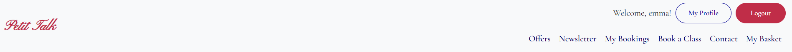
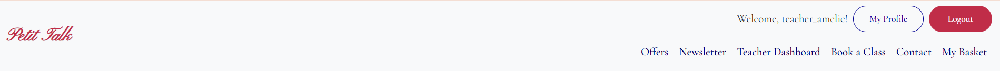

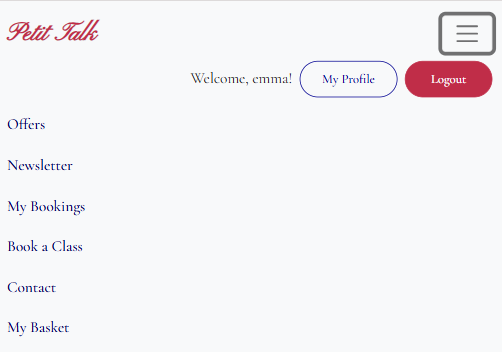
- User Registration, Login & Logout: Lets guests create accounts, log in to access booking features, and log out securely.
Notes: Form validation ensures users provide correct and complete information.
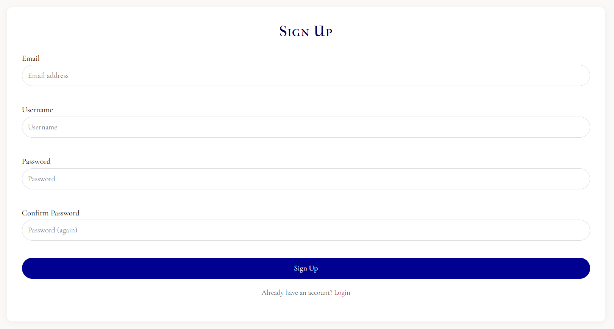

- Dynamic Call-to-Action Buttons: Buttons adapt based on the user’s login status.
     - If the user is not logged in, prompts encourage account creation or login.
     - If the user is logged in, buttons allow booking a class directly.
     
     
- A dynamic carousel showcasing all active teachers. Students can visit their profiles, learn more about each teacher, and easily book a class.

- Offers Section: Displays one active, dynamic offer created by the admin, along with two static offers highlighting group activities and other enticing opportunities for visitors.
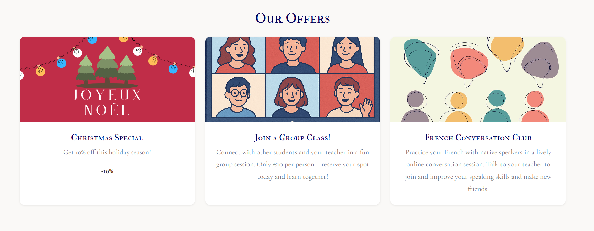
- Newsletter Signup; Allows users to subscribe and receive updates, promotions, new teachers etc.
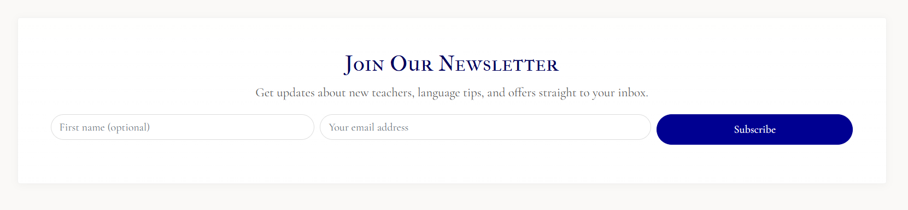
- Comment Section: Displays approved comments from students sharing their experiences with the site and teachers. Each username links to the user’s profile, allowing visitors to explore other users interested in learning French. A comment form is also provided for submitting new feedback, which the admin must approve before it appears publicly.

- Footer: Provides links to social media and a direct link to the contact page.

- Book a Lesson Page: A page where students can schedule a lesson by selecting the teacher, date, time, and specifying their lesson goal.

- My Bookings Dashboard: A dashboard where students can view their bookings, including the teacher, date, time, and status (paid, confirmed, pending etc...).
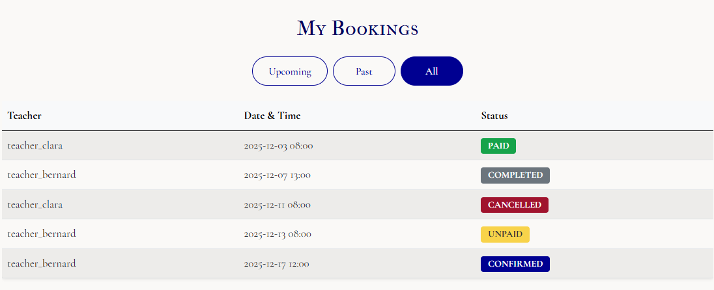
- Basket Page: A page where all unpaid bookings are stored before checkout. Displays active offers and their discounts, showing the price before and after the offer. Each booking’s details are visible, with the option to remove items from the basket.
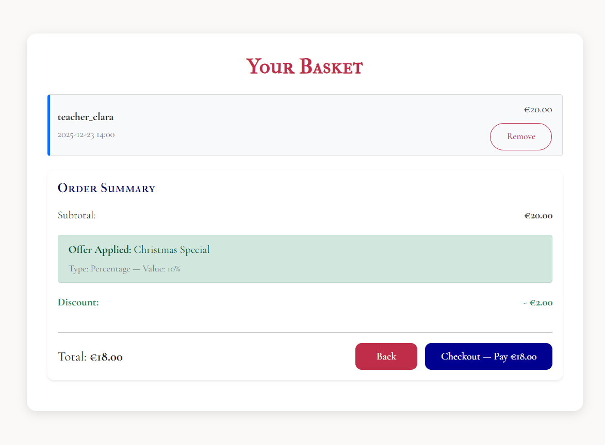
- Checkout Page: A page where users enter their card and cardholder details to complete payment. The payment process will be described in more detail later in this README.
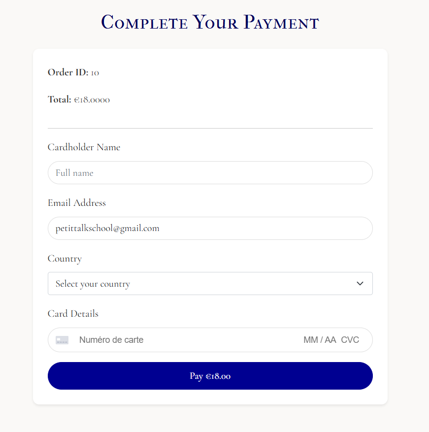
- Contact Page: A page providing social media links and an email address for users to get in touch.

-Admin Booking Dashboard: A dashboard where the admin can view all bookings, including their status. Provides links to teacher and student profiles and allows the admin to update the booking status.

- Admin Offer Dashboard: A dashboard where the admin can view and edit both active and inactive offers. Includes a form to create new offers, with the restriction that only one offer can be active in a basket at a time.

- Admin Teacher Dashboard: A dashboard where the admin can view and edit existing teachers, and use a form to add new teachers.

- Admin Comment Dashboard: A dashboard where the admin can approve or delete comments. Each comment includes a link to the creator’s profile.

- Admin Newsletter Subscription Dashboard: A dashboard where the admin can view all subscribed email addresses and unsubscribe users if needed.
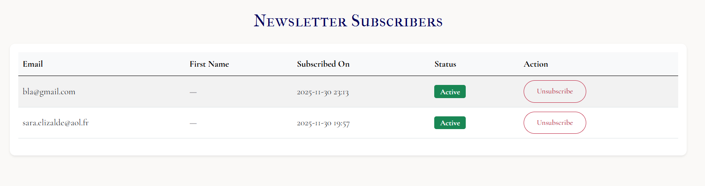
- Teacher Dashboard: A dashboard where teachers can view all their bookings, confirm or decline them, and update the booking status, which is reflected in both the student and admin dashboards. Each booking includes a link to the student’s profile.
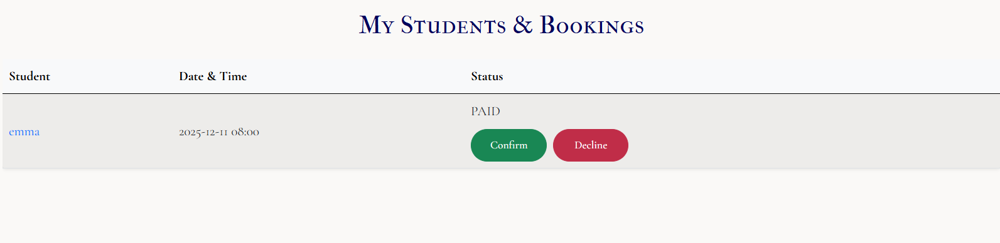
- Student and Teacher Profiles: Profiles that can be edited when the user is logged in. Features include:
     - Upload a profile picture (a default image is provided).
     - Teachers can upload an introductory video.
     - Students can specify their level and learning goals.
     - Both can add their favorite French books, movies, words, and songs to create a cultural template, allowing others to discover new French content.

## 4. Planning
### 4.1 User Stories
All user stories are documented in the Agile tool linked to this project. Each story includes detailed acceptance criteria and associated tasks. There are 29 user stories and 7 epics in total on the project board, and all have been completed. All of them are connected to an Epic and a Sprint on the board and in this document.

### 4.2 Epics
Seven epics were created to organize and plan this project:

### 4.3 Sprints
Four Sprints were created to organize and plan this project:

### 4.4 Database Diagram
To plan the relationships between my models, I created the following database diagram.
 - User (Django built-in)
 
 - Profile Model
 
 - Booking Model
 
 - Order Model
 
 - Offer Model
 
 - Newsletter Model
 
- Comment Model
 
- Models Relationship
 
### 4.5 Project Structure
The project was initially organized to maintain a clear and scalable folder structure. Some changes were made during development, such as renaming files and adding new templates.

### 4.6 App Overview & Responsibilities
#### Home App:
- Purpose:
Serves as the public-facing entry point of the website.
- Responsibilities:
Displays the homepage with hero banner, introduction, and featured offers.
Provides navigation links to other sections (Bookings, Offers, Contact, Login/Register).
Contains general static pages.
#### Profile App
- Purpose:
Manages user profiles and account-related pages.
- Responsibilities:
Extends Django’s built-in authentication system.
Provides profile page with editable information (photo, learning goals, language level).
Handle role-based profile views (teacher/student/admin)
#### Bookings App
- Purpose:
Handles all logic related to class scheduling and management.
- Responsibilities:
Allows users to select class date, time, level, and purpose.
Stores and manages bookings linked to user accounts.
Displays booking details, status (pending/confirmed/completed/cancelled/paid/unpaid), and teacher assignment.
Integrates with the Order app during checkout to confirm payment.
Handle booking creation per teacher
Check availability based on teacher’s calendar
#### Order App
- Purpose:
Acts as the shopping cart for temporary session-based storage of selected bookings.
- Responsibilities:
Adds and removes bookings before checkout.
Displays subtotal and dynamically updates totals.
Manages session-based cart data until payment is confirmed.
#### Checkout App
- Purpose:
Processes payments securely and finalizes orders.
- Responsibilities:
Integrates Stripe for online payments.
Handles order creation, confirmation, and Stripe webhook responses.
Updates booking status to “paid” and generates confirmation toast/messages.
Provides order summary and success/failure pages.
#### Offers App
- Purpose:
Manages promotional offers that apply to user orders.
- Responsibilities:
Stores details of active/inactive offers (discount type, value, and description).
Applies valid offers automatically or via code during checkout.
Enables admin control to add, edit, hide, or remove offers dynamically.
#### Newsletter App
- Purpose:
Collects email subscriptions for marketing and communication purposes.
- Responsibilities:
Provides a newsletter signup form in the homepage.
Stores user emails in a simple database model for future campaigns.
Allows admin to manage subscribers through the Django admin interface.
#### Comments app
- Purpose:
Manages user-generated content (comments or posts) displayed on the homepage or profile pages.
- Responsibilities:
Allow users to submit a short message, testimonial, or post.
Require admin approval before being displayed.
Allow admin moderation (approve/delete).
Display approved comments on the homepage or under profile pages.

## 5. Testing
### 5.1 Validators and Linters
- [CI Python Linter](https://pep8ci.herokuapp.com/): Initially found multiple syntax and style issues. All have been resolved.
- [W3C Markup Validator](https://validator.w3.org/): Every errors have been resolved.
- [W3C CSS Validator](https://jigsaw.w3.org/css-validator/): No errors found.
- [JS Hint](https://jshint.com/): No errors found.
- Lighthouse 
A report generated with Chrome Lighthouse showed no major issues with performance or accessibility.

- [XML-Sitemaps.com](https://www.xml-sitemaps.com/validate-xml-sitemap.html) Came back with no issues detected.

### 5.2 Automated Tests
A total of 46 automated tests were written to cover models, views, and forms across both applications.
All tests passed successfully.

### 5.3 Manual Tests
Throughout development, I continuously performed manual testing to ensure that each feature worked as intended after implementation. 
I carried out a full round of manual testing on all of the following: 
#### Registration & Login:
- Users can register with valid data.
- Validation errors appear when form inputs are incomplete or invalid.
- Users can log in with correct credentials.
- Incorrect credentials display an appropriate error message.
- Registration and login pages are only accessible to anonymous users; logged-in users are redirected away.
#### Logout & Session Management:
- Users can log out successfully.
- After logging in, the navbar updates with the correct links and reflects the current login state.
- Session state persists correctly across pages until the user logs out.
#### Role-Based Access Control:
- Students, teachers, and admins can only access pages relevant to their role.
- Unauthorized attempts to access restricted pages redirect to a login page or display an access denied message.
- Role-based permissions are enforced across the application, preventing non-admin users from accessing admin functionality.
#### Additional Security Checks:
- Users cannot bypass authentication to access protected resources directly via URLs.
#### Bookings
#### Creating & Managing Bookings (Student Dashboard):
- Authenticated students can create a new booking by selecting a teacher, date, time, and lesson goal.
- Booking form validates inputs (example: date cannot be in the past, 48h in advance, required fields must be filled).
- Successful bookings are saved in the database and displayed in the student’s My Bookings Dashboard.
- Students cannot delete confirmed/paid bookings from their dashboard. They can remove unpaid bookings from the basket, and doing so updates their bookings dashboard accordingly. Paid bookings can only be deleted by the admin. This functionality represents a future improvement to allow more flexible booking management.
- Students cannot edit or cancel other users’ bookings; attempting to do so displays an error or redirect (404 page).
#### Teacher Dashboard:
- Teachers can view all bookings assigned to them.
- Teachers can confirm or decline bookings, and the status is updated in both the student and admin dashboards.
- Teachers can view student profiles linked from each booking.
#### Admin Dashboard:
- Admin can view all bookings, including status, teacher, and student details.
- Admin can update the status of any booking.
#### Capacity & Validation Checks:
- System prevents overlapping bookings if the teacher is unavailable at the selected time.
- All CRUD operations (create, read, update, delete) are validated to ensure only authorized users can perform actions.
#### Order
#### Basket Functionality:
- Only the student who created a booking can view and modify their own basket.
- Students can remove unpaid bookings from the basket; doing so updates the bookings dashboard and recalculates the total.
- The system correctly applies the active offer to the total price.
- Each class is priced at €20, and the total reflects the sum of all bookings with offers applied if any.
- Upon payment completion, the basket is emptied, and all bookings are marked as paid.
#### CRUD Operations:
- Create: Adding a booking automatically adds it to the basket if unpaid.
- Read: Students can view all items in their basket with details of the booking and pricing.
- Update: Removing an unpaid booking updates the basket and recalculates the total.
- Delete: Only unpaid bookings can be removed by the student; paid bookings can only be deleted by the admin.
#### Validation & Permissions:
- Students cannot modify or remove bookings belonging to other users.
- The basket always reflects the correct total and applied discounts.
#### Checkout
#### Checkout Form Validation:
- Users must provide all required fields: full name, email, country selection, and card information.
- Validation errors appear if any field is incomplete or invalid (example: missing email, incorrect card number).
#### Payment Processing (Stripe Integration):
- If payment succeeds, the user is redirected to a success page confirming the transaction.
- If payment fails, the user is redirected to an error page.
- The basket is cleared only after successful payment.
- Bookings associated with the order are marked as paid upon successful payment.
#### Additional Tests:
- Attempting to access the checkout page with an empty basket redirects the user appropriately.
- Users cannot pay for bookings that are already marked as paid.
- Total price calculation matches the sum of bookings in the basket, including any active offers or discounts.
- Attempting to submit invalid card details triggers the Stripe error response and does not process payment.
- All redirects and success/failure messages are displayed clearly and are user-friendly.
- Data integrity: bookings remain correctly associated with the user after payment, and no unpaid booking is lost.
#### Security Checks:
- Sensitive information (card data) is never stored on the server; Stripe handles all sensitive data.
- Users cannot manipulate the total price or bypass payment via the frontend.
#### Offers
#### Admin Functionality:
- Only the admin can create, edit, or deactivate offers.
- Offers can be either a percentage discount or a fixed amount, and the system correctly applies the discount to the basket total.
- Admin can upload an image for each offer, which is displayed to students when the offer is active.
#### Student / Basket Interaction:
- If an offer is active, it is automatically applied to the total price in the basket.
- If an offer is inactive, it does not affect the basket total and is not displayed to students.
- Students cannot create, edit, or activate offers; they can only view active offers.
#### Display & Validation:
- Active offers are displayed with their discount type, value, and image.
- Inactive offers are hidden from the basket and frontend display.
- The basket total price updates correctly whenever an offer is applied or removed.
#### Additional Tests:
- Switching an offer from active to inactive updates all student baskets in real-time.
- Creating an offer without required fields (discount value, type, or image) triggers validation errors.
- Editing an active offer updates the basket totals and display correctly for all students.
#### Newsletter Subscription
#### Student Functionality:
- Users can subscribe to the newsletter by entering a valid email address.
- The subscription form validates input and displays errors for invalid or empty email fields.
- After successful subscription, a confirmation message is displayed to the user.
- Subscribed users are added to the newsletter list stored in the database.
#### Admin Dashboard:
- Only the admin can access the newsletter subscription dashboard.
- The admin can view the full list of subscribed email addresses.
- When a new user subscribes, the admin dashboard updates accordingly.
- The admin can remove (unsubscribe) any email from the list, and the change is reflected immediately.
- Students and unauthenticated users cannot access or manipulate the subscription list (access is restricted).
#### Validation & Security:
- Duplicate email subscriptions currently trigger the generic “Please enter a valid email” validation message. This does not clearly indicate that the email is already subscribed. This behavior will be improved in a future update to display a clearer, more specific message to the user.
- Unauthorized attempts to access admin newsletter routes redirect appropriately (login or error page).
#### Comments
#### Student Functionality:
- Only logged-in users can access the comment form and submit a comment.
- Attempting to access the comment form while logged out redirects the user to the login page.
- The comment form validates required fields and displays an error if the content is empty.
- After submitting a comment, the user receives a confirmation that their comment is awaiting approval.
#### Admin Dashboard:
- Only the admin can view all submitted comments in the admin comment dashboard.
- The admin can approve or delete any comment.
- Approving a comment updates the dashboard immediately and moves the comment to the “approved” state.
- Deleting a comment removes it permanently and prevents it from appearing anywhere on the site.
- Students and teachers cannot access the admin comment dashboard.
#### Home Page Display:
- Only approved comments are displayed publicly on the home page.
- Approved comments show the correct username, profile link, and text.
- When a comment is approved, it appears instantly on the home page without errors.
- Unapproved comments are never shown on the home page or anywhere publicly.
#### Validation & Permissions:
- Users cannot approve or delete comments—these actions are restricted to the admin only.
- Users cannot submit comments on behalf of others.
- Admin actions correctly reflect across all dashboards (admin, teacher if needed, and home page).
#### Profiles & Teacher Creation
#### Teacher Account Creation (Admin Only)
- Only the admin can create new teacher accounts through the admin dashboard.
- Creating a new teacher validates all required fields (email, username, password, role).
- Newly created teachers appear immediately in the teacher list and can log in with their credentials.
- Teachers are automatically assigned the correct permissions and role-based access upon creation.
- If required fields are missing or invalid, appropriate form errors are displayed.
- Duplicate usernames/emails are prevented by Django authentication validation.
#### Profile Display (Students & Teachers)
- Every user has a profile page showing:
     - Username
     - Profile picture (default if none)
     - Role-specific fields
- Student profiles display level, learning goals, and cultural favorites (books, movies, words, songs).
- Teacher profiles display biography, introduction video (if uploaded), and cultural favorites.
- Profile pages load correctly without layout issues.
#### Profile Editing (Own Profile Only)
- Only logged-in users can edit their own profile.
- Unauthorized profile edits return a redirect or error.
- Students can update: profile picture, level, learning goals, bio, cultural favorites.
- Teachers can update: profile picture, introduction video, biography, cultural favorites.
- All updates save correctly and appear immediately.
#### Media Uploads (Images & Videos)
- Profile picture uploads accept valid image types.
- Updated images replace the old one and display correctly everywhere once saved.
- Teachers can upload an introduction video.
- Videos display and play correctly on teacher profiles.
#### Security Checks
- Users cannot change their role or access admin-only routes.
- Students/teachers cannot edit each other’s profiles.
- Direct URL access to restricted edit pages is blocked.

### 5.4 Responsiveness & Accessibility
- Website is responsive on desktop, tablet, and mobile.
- Navbar collapses correctly on smaller screens.
- Text and buttons are readable on all screen sizes.
- Staff and teachers dashboards are optimized for larger screens. On smaller screens, a horizontal scroll bar appears for the tables to maintain usability without breaking the layout.
- Tested on Chrome DevTools with multiple screen sizes
- The website has been tested on different browsers such as Chrome, Firefox and Safari and all works.

## 6. E-Commerce Implementation
### 6.1 E-Commerce Business Model
Petit Talk generates revenue through online French lessons delivered by native speakers. The business model is structured to provide flexibility for users while maximizing engagement and sales through lesson and promotional offers.
#### Revenue Streams:
- Individual Lessons – Students can purchase lessons for immediate scheduling.
- Lesson Bundles / Packs (Future Implementation) – Packages of 5, 10, or 20 lessons at discounted rates to encourage bulk purchases.
- Promotional Offers – Seasonal discounts, exam prep bundles, and referral bonuses to drive conversions and retain users.
#### Value to Users:
- Flexible scheduling and tailored lesson plans.
- Transparent pricing with bundled discounts for committed learners.
- Access to native French speakers and authentic learning experiences.
- Personalized dashboards to track bookings, payments, and progress.
### 6.2 Payment System & Stripe Integration
Petit Talk uses Stripe to securely process online payments.
Stripe webhooks are implemented to verify whether a payment has succeeded or failed, and all transactions can be monitored through the Stripe Developer Dashboard.
#### Payment Flow:
- Users create one or several bookings, add them to their basket, active offers automatically update the total price and proceed to checkout.
- Form validators ensure that users provide a full name, a valid email address, a country, and a valid card number.
- (Known limitation: the price sometimes displays as 18.0000 instead of 18.00. This is only a formatting issue and does not affect the actual charged amount.)

- A Stripe PaymentIntent is created in Django and returned to the frontend.
- Stripe.js confirms the payment securely using the user’s card details.

- Stripe webhook finalizes the order:
     - Success: A confirmation page is shown, a success message is displayed, and the booking becomes PAID in the student/teacher and admin dashboard.
     
     - Failure: An error message informs the user, and the booking stays UNPAID and in the basket.
     
### Security & Best Practices
- Stripe public and secret keys are securely stored in env.py and in Heroku CONFIG VARS, never in the GitHub repository.
- Any keys that were accidentally pushed to GitHub were IMMEDIATELY REPLACED with new keys both locally and on Heroku.

## 7. Authentification & Role-Based Authorization
The application uses a secure authentication system to manage user access and protect sensitive data. Users can register, log in, and access functionality based on their assigned role (Student, Teacher, or Admin). Role-based authorization ensures that users can only access the features relevant to their role, maintaining privacy, security, and operational integrity.

### Access & Permission:

#### Role Assignment:
Roles are assigned during registration or by admin approval.
- Students are auto-assigned upon signup.
- Teachers are created by the admin in his dashboard, but can update their own profile, upload photo and video.
- Admin accounts are pre-assigned by system setup.
- User Feedback on Access: Unauthorized access attempts are redirected to a safe page such as the homepage.

## 8. SEO & Marketting
### 8.1 Target Audience
The platform is designed for English speakers interested in learning French with a native teacher. Key user groups include:
- Students (Teens & University Level)
Needs: Academic support, exam preparation, improved grades.
Motivations: Passing school requirements, strengthening CVs, preparing for exchange programs.
Approach: Promote affordable lesson packages, flexible scheduling, and the benefit of learning directly with a native speaker.
- Parents of Students
Needs: Reliable and effective tutoring for their children.
Motivations: Supporting academic success.
Approach: Highlight professionalism, safety, and proven results. Showcase structured lesson plans and progress tracking.
- Adult Learners & Professionals
Needs: Language skills for career advancement, relocation, or business travel.
Motivations: Professional development, competitive advantage, international opportunities.
Approach: Position lessons as efficient, tailored, and practical. Present the service as a higher-value investment compared to free apps.
- Travelers & Culture Enthusiasts
Needs: Conversational skills and cultural insights for authentic experiences abroad.
Motivations: Enhancing travel, enjoying French lifestyle and traditions.
Approach: Use aspirational branding (café, Parisian atmosphere). Offer crash courses and cultural content.
- Retirees & Hobby Learners
Needs: Stimulating and enjoyable activity.
Motivations: Lifelong learning, cultural connection, personal enrichment.
Approach: Emphasize fun, community, and learning at a comfortable pace.
Key Differentiator: The “real French teacher” element builds authenticity, credibility, and cultural immersion across all segments.
### 8.2 Platforms for Engagement
- Facebook

- Primary Audiences: Parents, retirees, and adult learners (30+).
Why it Works: Strong with older demographics, active parenting and education communities, and precise demographic targeting for ads.
Content Style: Testimonials, structured offers, cultural insights.
- Instagram
Primary Audiences: Students, young adults, travelers, and professionals (16–35).
Why it Works: Visual, aspirational, and lifestyle-driven platform. Strong reach through reels and hashtags.
Content Style: Short lessons, travel phrases, cultural tips, and aspirational French-themed visuals.
### 8.3 User Needs and Content Strategy
- Parents (Facebook)
Needs: Trustworthy support for children’s French classes.
Content: Testimonials, before/after success stories, learning tips.
Delivery: Facebook posts/ads; email newsletters with progress tips and resources.
- Retirees (Facebook)
Needs: Engaging cultural activity and travel preparation.
Content: Simple phrases, cultural spotlights, brain-health stories.
Delivery: Friendly Facebook posts; email “word of the week” campaigns.
- Students (Instagram)
Needs: Exam prep, quick learning, stress relief.
Content: Grammar hacks, vocabulary challenges, humor/memes.
Delivery: Instagram reels, quizzes, and email reminders before exams.
- Travelers (Instagram)
Needs: Practical phrases, cultural etiquette.
Content: Travel-specific reels, visual phrase carousels, mini cultural guides.
Delivery: Instagram posts; downloadable PDF “French Travel Survival Kit” via email signup.
- Professionals (Instagram & Email)
Needs: Efficient career-focused learning.
Content: Business vocabulary, case studies, productivity tips.
Delivery: Instagram carousels; segmented email sequences promoting professional packages.
- Multi-Channel Approach:
Facebook → Trust-building with parents and retirees.
Instagram → Engagement with students, travelers, and professionals.
Email → Nurturing and conversions across all audiences.
### 8.4 Sales and Promotions
- Bundle Offers
Buy 5 lessons, get 1 free.
10-lesson packs at reduced per-unit cost.
Purpose: Encourage commitment and increase retention.
- Seasonal Offers
Exam Prep Bundles (spring/fall).
Travel Crash Courses (summer, holidays).
New Year/Back-to-School Promotions.
- Communication Channels
Parents & Retirees: Facebook posts/ads and email newsletters with clear, trust-building messages.
Students: Instagram reels/stories and exam-season email offers.
Travelers/Young Adults: Instagram visuals and email freebies (phrase guides leading to bundles).
- Timing Strategy
Exam seasons: Focus on Instagram + email for students.
Travel seasons: Emphasize Instagram aspirational posts + follow-up emails.
Year-round: Keep bundle promotions active on Facebook and within email drip campaigns.
### 8.5 Marketting Goals and Supporting Strategies
- Goal 1: Attract New Users
Strategy: Increase brand awareness through shareable content and targeted advertising.
Tactics: Instagram reels showcasing lessons, Facebook ads targeted to relevant audiences, SEO-optimized blog posts on learning French.
KPIs: Reach, impressions, website visits from social channels.
- Goal 2: Convert Visitors into Paying Students
Strategy: Encourage sign-ups with clear offers and strong calls-to-action.
Tactics: Bundle deals, dedicated landing pages for special offers, email nurture sequences highlighting teacher expertise and testimonials.
KPIs: Sign-ups, checkout conversions, coupon redemptions.
- Goal 3: Retain Customers
Strategy: Build loyalty through consistent value, engagement, and rewards.
Tactics: Newsletter campaigns, repeat-purchase discounts, referral programs, push notifications for upcoming classes.
KPIs: Repeat bookings, newsletter open rates, referral conversions.
- Goal 4: Build Brand Identity
Strategy: Leverage authenticity, cultural appeal, and teacher/student stories.
Tactics: Consistent French-inspired branding across website and socials, behind-the-scenes content, teacher/student spotlight reels and stories.
KPIs: Engagement (likes, shares, comments), brand recall metrics, social media followers growth.
- Channel Focus:
Facebook: Target parents and older audiences — longer, trust-building content.
Instagram: Target students, travelers, professionals — short, aspirational content.
Email: Target all segments for conversion and retention (newsletters, promotions, personalized reminders).
### 8.6 SEO Techniques
Meta tags: Petit Talk includes a clear and engaging meta description in the head:
- "Petit Talk offers online French classes with native French speakers. Learn French interactively from the comfort of your home."
Keywords: Carefully chosen keywords are included in the head to attract the target audience:
- "French classes, online French lessons, learn French, French tutors, Petit Talk, language learning, online education"
- Additional SEO features: The website implements a sitemap, a robots.txt file, and a custom 404 error page to enhance search engine visibility and improve user experience.

## 9. Deployment & Setup
This project was deployed to [Heroku](https://id.heroku.com/): a hosting platform.

1. Create a Database 
     - I used PostgreSQL.
2. Create a new app on Heroku.
     - Navigate to the Heroku dashboard and create a new app.
3. Configure Database
     - In the 'Settings' tab of your new app, under 'CONFIG VARS', add a key called DATABASE_URL and paste the database URL into the value field.
4. Configure Stripe
     - Create a Stripe account if you don’t have one.
     - In your env.py file and Heroku CONFIG VARS, add:
          - STRIPE_PUBLIC_KEY=<your-public-key>
          - STRIPE_SECRET_KEY=<your-secret-key>
     - Use test keys for development and live keys for production.
5. Configure AWS for Media Storage
     - Create an AWS S3 bucket for storing media files.
     - Add the following to your env.py file and Heroku CONFIG VARS:
         - AWS_ACCESS_KEY_ID=<your-access-key>
         - AWS_SECRET_ACCESS_KEY=<your-secret-key>
         - AWS_STORAGE_BUCKET_NAME=<your-bucket-name>
     - Update settings.py to use django-storages for media storage with:
         - DEFAULT_FILE_STORAGE = 'storages.backends.s3boto3.S3Boto3Storage'
6. Clone the repository from GitHub and connect to Heroku
    - Clone the repository from GitHub locally.
    - Connect your project to Heroku via the Deploy tab.
7. Add your env.py file to .gitignore
     - Ensure all sensitive environment variables are stored only in your env.py file and never pushed to GitHub, including: 
         - SECRET_KEY
         - STRIPE_PUBLIC_KEY
         - STRIPE_SECRET_KEY
         - AWS_ACCESS_KEY_ID
         - AWS_SECRET_ACCESS_KEY
         - AWS_STORAGE_BUCKET_NAME,
8. Update your CONFIG VARS section on Heroku
     - Add the same environment variables to Heroku’s CONFIG VARS.
9. Configure Django settings
     - Update your settings.py to read from environment variables (SECRET_KEY, DATABASE_URL, DEBUG...).
     - Set ALLOWED_HOSTS to include your Heroku app's domain.
     - Configure static files using WhiteNoise by adding it to MIDDLEWARE in settings.py.
     - Ensure DEBUG = False in production, and DEBUG = True locally for development.
10. Install Dependencies
     - Ensure all dependencies are installed by running: pip install -r requirements.txt
11. Collect Static files
     - Collect the static files in your project using: python manage.py collectstatic
12. Create a Superuser
     - Run : python manage.py createsuperuser
     - Follow the prompts to set username, email, and password(this allows you to access the Django admin panel).
13. Deploy the App
     - Go to the Deploy tab of your app in Heroku.
     - Choose the main branch.
     - Click Deploy Branch manually.
     - Once deployed, visit your Heroku app to verify it is running.

## 10. Development

#### Visual Design
- During the planning phase, I created a visual layout using Bootstrap, which effectively served as a wireframe to map out the structure of each page. I also designed a color palette and a logo early on, which guided the overall visual style and ensured consistent design choices throughout development.

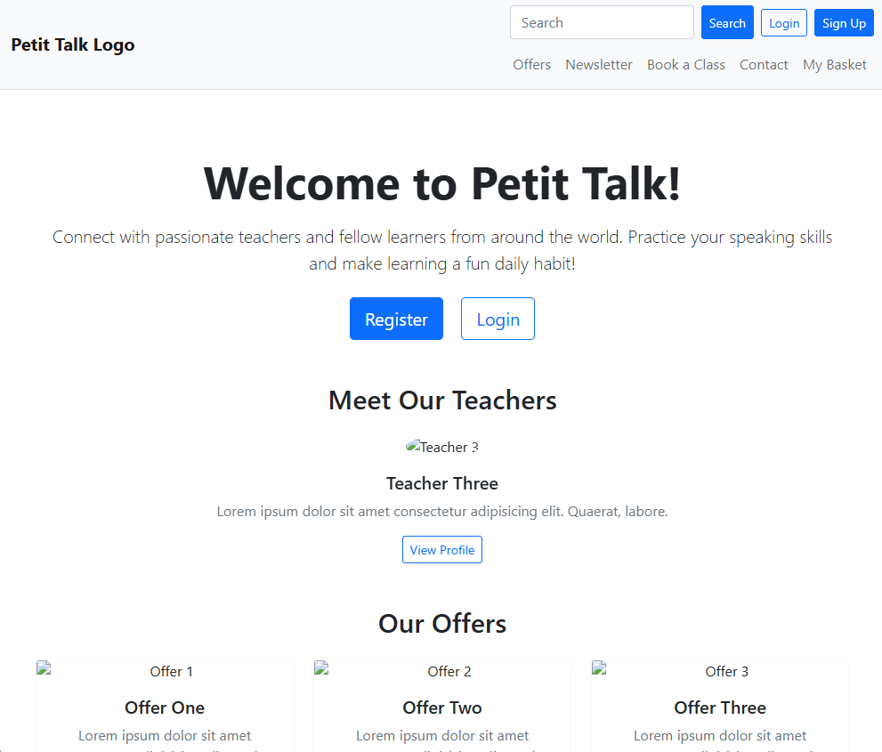
#### Initial Planning
- During initial project setup, the main goals were: 
#### Configure the project and apps
- Created core apps: userprofile, bookings, order, offers, newsletter, comments, checkout and home.
- Configured Django Allauth for registration, login, and logout.
#### Custom User model considerations
- Initially considered creating a fully custom User model with additional fields (is_student, is_teacher, is_staff) to handle role-based access. Faced migration conflicts due to existing Django auth.User and admin dependencies. I considered deleting migration files and the database to fix conflicts, but this risked losing setup and historical data. I installed required packages including Pillow for image handling to avoid errors. I then decided not to override Django’s default User model. I added roles (is_student, is_teacher) directly in a Profile model, which is a one-to-one extension of User. This allowed role management, additional profile fields, and image uploads via Pillow without breaking existing migrations or admin registration.
- Created some templates: 
     - base.html 
     - index.html 
     - and styling.
#### Linked Profile and user so a Profile is automatically created when a User is
- Implemented a OneToOne relationship between User and Profile.
- Added a post_save signal in models.py to automatically create or update a Profile whenever a User is created or saved.
- Verified the creation of profiles for existing users and superusers using the Django shell.
- Ensured that both new and existing users have associated Profile objects for role-based access and extended user data.
- Created a complete user profile system:
     - Views & URLs: Added profile_detail and edit_profile views with routes for both the current user and specific teachers.
     - Templates: Built profile_detail.html and edit_profile.html with a responsive, clean design consistent with the website’s style.
     - Forms: Simplified the ProfileForm, removed the timezone field, and prepared intro_video for teacher use only.
     - Media: Configured media settings for image and video uploads, and added a default static profile image (and later used AWS).
#### Implemented a complete booking system allowing students to schedule lessons with teachers.
- Views & URLs: Added the book_lesson view with validation, role restrictions, and a dedicated route for booking.
- Forms: Created a custom BookingForm with teacher selection, date/time checks (48h rule), and goal input.
- Templates: Built a responsive booking page using Bootstrap with clear success/error messages.
- Access Control: Enforced role logic so only students can book and teachers appear as selectable options.
- Admin: Extended the admin panel to manage students, teachers, and bookings, with filtering, editing, and media support.
#### Orders & Temporary Payment Logic
- Created Order model linking students to multiple bookings, with total amount and paid status.
- Implemented automatic bag: pending bookings appear as unpaid in the bag.
- Students can view and remove bookings from their bag.
- Teachers and dashboards reflect paid/unpaid status for bookings.
- Added temporary payment logic: marking the bag as paid updates all included bookings to paid.
- Stripe integration and offers were added later.
#### Orders & Bag System
- Added a new Order model that stores:
     - The student
     - Related bookings (M2M)
     - Total price
     - Stripe payment identifiers
     - Whether the order is paid or not
- Implemented an automatic bag (basket) system:
     - Every user has exactly one unpaid order acting as their bag.
     - When a student creates a booking, it is added to their bag instead of being immediately confirmed.
     - Total price is automatically calculated based on the number of bookings.
     - Students can view and remove items from the bag.
#### Checkout App (Stripe Integration)
- Created a separate checkout app responsible only for payment flow, not CRUD (taht is the order app).
- Implemented Stripe Checkout Session creation:
     - Sends order details (total, student email).
     - Redirects user to Stripe’s secure payment page.
- Added webhook handling:
     - Confirms payment server-side.
     - Marks the Order as paid.
     - Updates all linked Bookings to status PAID.
- Added success/error pages.
- Status Updates
     - After Stripe confirms payment:
          - The Order becomes paid=True.
          - Each booking inside the order is updated from UNPAID/PENDING → PAID.
          - Student dashboard shows paid bookings.
          - Teacher and admin dashboard displays lessons as paid but still to be confirmed.
- Settings
     - Added environment variables for:
          - STRIPE_PUBLIC_KEY
          - STRIPE_SECRET_KEY
          - STRIPE_WEBHOOK_SECRET
          - SITE_URL
#### Booking System
- During development of the booking system, I faced several challenges and iterated to improve user experience and validation:
    - Time Selection UX: 
    Initially, the scheduled_time field used a datetime-local input that included minutes, which could confuse users. I split the input into a date field and an hour dropdown, limiting selection to hourly slots between 08:00 and 19:00. This simplifies booking and avoids users selecting unsupported times.
     - 48-Hour Advance Rule:
     Bookings must be made at least 48 hours in advance. During validation, I encountered:
         - A TypeError when scheduled_time was None.
         - Duplicate error messages when using ValidationError in the form’s clean() method.
     - Double-Booking Prevention: 
     Validation now ensures that a teacher cannot be booked for the same time slot more than once (ignoring cancelled or completed bookings). This is checked in the form’s clean() method.
     - Frontend Improvements: 
          - Minutes selection removed to avoid confusion; only on-the-hour booking allowed.
          - Template scripts ensure any manually edited datetime inputs still default to :00 minutes.
          - Non-field validation errors are displayed clearly.
#### Implement the Offer model to manage promotional discounts that can be applied to orders.
- Created Offer model with fields:
     - name
     - description
     - discount_type (percentage, fixed_amount, bundle)
     - discount_value
     - active (boolean to toggle visibility without deleting)
- Admin interface allows toggling offers as active/inactive or create a new one (only one offer can be active at the moment).
- Built a view for active_offers to display on the homepage.
#### Automatically apply promotional offers to orders and show the discounted total in the student’s bag.
- Automatic Offer Application:
     - The system fetches the first active offer and applies it to the student’s unpaid bookings.
     - Only admin can create, update and delete offers.
-  Order Model Updates:
     - subtotal and total_eur fields updated dynamically when offers are applied.
     - calculate_total method now considers the active offer to compute discounted totals.
- Bag Template Enhancements:
     - Shows offer name, type, and value if applied.
     - Displays discount amount and formats totals to 2 decimal points for clarity.
     - Layout updated to match site style with consistent fonts, colors, and buttons.
#### Admin Teachers Dashboard
- A full CRUD interface for managing teachers:
     - Create teachers (with associated Django User + Profile automatically generated)
     - Edit teacher profiles
     - Delete teachers
     - View all active registered teachers
- Automatic Teachers Carousel: The homepage teacher carousel now automatically displays:
     - Teacher profile images
     - Teacher names
     - Their bio (if any)
     - A “View Profile” button linking to /profile/<pk>/ (their profile)
- Only active teachers (is_teacher=True) are shown, making the section dynamic and easy to maintain.
#### Prefilled Teacher Field in “Book a Class”
- From a teacher’s profile page, clicking Book a Class now automatically:
     - Redirects the user to the booking form
     - Prefills the teacher field using a teacher=<id> query parameter
- This ensures students always book the correct teacher and reduces user error.
#### Comments System:
- Created a Comment model linked to both the User and their Profile to associate comments with specific users.
- Built views and forms to allow authenticated users to submit comments, which are initially marked as unapproved.
- Implemented a public view to display approved comments on the homepage, linking each comment to the user’s profile.
- Admin Dashboard for Comments:
     - I developed an admin dashboard where staff can view all comments, approve them, or delete inappropriate ones.
     - Integrated views, URLs, and templates for the dashboard with access restricted using staff_member_required.
     - Added navbar links for admin users to quickly access the dashboard.
     - Styled the dashboard using Bootstrap and the site’s existing CSS for a consistent look and feel.
#### Custom Error Page (404), Sitemap & Additional Backend Features
- 404 Error Page: 
     - Implemented a custom 404.html template to provide a branded, user-friendly error page.
     - Ensures users are guided back to key areas of the website instead of seeing Django’s default debug page.
     - Styled to match the site’s overall colors, typography, and layout for consistency.
- Sitemap: 
     - Added a sitemap (sitemap.xml) to support SEO, faster indexing, and structured navigation for search engines.
     - Included important routes such as home, teacher profiles, booking pages.
     - Registered sitemaps in urls.py.
- Stripe Webhook Handlers: 
     - Created a dedicated webhook.py inside the checkout app to process Stripe events securely.
     - Handles events such as payment_intent.succeeded.
- Custom Payment Page
     - Instead of using Stripe Checkout redirect-only flow, I built a custom payment page using Stripe.js and Django context data.
     - Displays Stripe payment form, and validation errors in real time.
     - Ensures the payment workflow matches the site’s design and provides a seamless, integrated checkout experience.
#### AWS
- During development, I needed to support user-uploaded media files (images and videos) for profiles and offers. Initially, the project used Django’s default FileSystemStorage, but on Heroku the local file system is not persistent, meaning uploads would be lost after each deploy or dyno restart.
- To solve this, I integrated AWS S3 for media storage. Because several older Django storage backends are now deprecated, I used the django-storages package with the S3Boto3Storage backend.
This setup allows all media files to be uploaded to and served directly from S3, while static files continue to be served through Django’s standard static file configuration.

## 11. Bugs Encountered
### 11.1. Bugs Encountered
#### Migration Conflicts & User Model Override Failure
- Issue:
     - Attempting to override Django’s default User model caused migration errors.
     - Django raised migration history conflicts and "already registered" admin errors.
     - Image uploads initially failed because Pillow was not installed.
- Fix:
     - Installed Pillow using pip install Pillow.
     - Abandoned the attempt to override the User model.
     - Moved role fields (is_student, is_teacher) into a separate Profile model with a OneToOne link.
     - Cleaned and verified all migrations, admin registration, and profile creation logic.
- Outcome:
     - Stable and reliable User/Profile architecture.
     - Role-based access works correctly.
     - Migration history remains consistent without conflicts.
#### Missing Profile for Pre-Existing Superuser
- Issue:
     - Logging into Django admin triggered a RelatedObjectDoesNotExist error: “User has no profile.”
     - The superuser was created before the profile-creation signal existed, so no Profile object was attached.
- Fix:
     - Manually created a Profile for the existing superuser using the Django shell:
          - from django.contrib.auth.models import User
          - from userprofile.models import Profile
          - u = User.objects.get(username='superuser')
          - Profile.objects.get_or_create(user=u)
     - Verified that the profile-creation logic works for all newly created users.
- Outcome:
     - All users, including the original superuser, now have Profile objects.
     - Django admin login works without errors.
#### User Signup Failure Due to Incorrect Allauth Configuration
- Issue:
     - New users could not sign up: the form submitted with no errors, created no user, and did not redirect.
     - The problem was caused by invalid Allauth settings (ACCOUNT_LOGIN_METHODS, ACCOUNT_SIGNUP_FIELDS) that are not supported, breaking the signup flow.
- Fix:
     - Replaced unsupported settings with valid Allauth configuration:
     - Enabled email-only authentication.
     - Disabled username requirement.
     - Disabled email verification for development.
     - Switched to Django’s console email backend.
     - Restarted development server to ensure configuration changes were applied.
- Outcome:
     - Signup flow works as expected.
     - User accounts are successfully created.
     - Users are correctly redirected after registration.
#### env.py Kept Being Committed Despite .gitignore
- Issue:
     - The env.py file (containing secret keys) continued to appear in GitHub even though it was included in .gitignore.
     - This happened because the file had been committed once before, so Git kept tracking it through history and merges.
- Fix:
     - Deleted both env.py and .gitignore locally and recreated them cleanly.
     - Added env.py back to the new .gitignore.
     - Committed the clean versions so Git would stop tracking the file.
     - Regenerated ALL SECRET KEYS, since the originals had already been exposed in the repository history.
- Outcome:
     - Git now ignores env.py correctly.
     - No sensitive data is tracked or pushed.
     - All project secret keys are fully replaced and secure.
#### Booking Status Not Updating & Missing from Order Bag
- Issue:
     - The Booking model contained an invalid line:
          - bag_bookings = Booking.objects.filter(student=request.user, status__in=['UNPAID', 'PENDING'])
     - This caused Django to crash on startup because:
          - Booking was referenced before being defined.
          - request is not accessible inside a model.
          - Database queries cannot run at class-definition time.
     - The model also lacked a status field, so bookings could not be marked UNPAID or PENDING, preventing them from appearing in the order bag.
- Fix:
     - Removed the invalid class-level queryset.
     - Added a proper status field with defined choices.
     - Ensured bookings are correctly detected as UNPAID or PENDING.
     - Validated status handling across checkout and bag views.
- Outcome:
     - Bookings now appear correctly in the user’s order bag.
     - Checkout calculations work as intended.
     - The Booking model loads without errors.
#### Double-Booking Bug (Student Scheduling Conflict)
- Issue:
     - Students could book two lessons at the same time with different teachers.
     - While the system prevented teacher conflicts, no validation existed for student scheduling.
     - Cause: BookingForm.clean() only checked for teacher conflicts, and the form did not know the student until after form.is_valid() was called.
- Fix:
     - Injected the student into the form before validation:
          - form.instance.student = request.user
     - Added a validation rule to prevent student conflicts
     - Form now blocks any student from booking overlapping lessons, even with different teachers.
- Outcome:
     - Teachers cannot be double-booked.
     - Students cannot book overlapping lessons.
     - Booking validation is consistent and reliable.
     - Database and form-level integrity for bookings is fully enforced.
#### Reliable Media Storage on AWS S3
- Issue:
     - During development, user-uploaded media (images/videos for profiles and offers) needed to persist across deploys.
     - Heroku’s local file system is ephemeral, so using Django’s default FileSystemStorage caused uploads to be lost.
     - Previous storage approaches were deprecated, and incorrect S3 configuration could cause ACL issues, inaccessible files, or query-string problems.
- Fix:
     - Integrated django-storages with S3Boto3Storage backend.
     - Configured environment variables for AWS credentials:
          - AWS_ACCESS_KEY_ID
          - AWS_SECRET_ACCESS_KEY
          - AWS_STORAGE_BUCKET_NAME
          - AWS_S3_REGION_NAME
     - Set proper STORAGES options to ensure uploaded files were publicly accessible via S3 URLs.
     - Tested thoroughly in both local and Heroku environments.
- Outcome:
     - Users can reliably upload profile and offer media.
     - Media files persist across deploys and dyno restarts.
     - Static files remain served via Django’s standard static file configuration.
### 11.2. Unresolved Bugs
#### Checkout Total Displaying Four Decimals: 
- Issue:
     - On the checkout page, the total price display with four decimal places instead of the usual two (example: 20.0000 instead of 20.00).
     - The actual calculations and charges are correct; only the display formatting is affected.
#### Only One Active Offer Displayed in Basket/Homepage
- Issue:
     - Even if multiple offers are active, only one active offer appear in the basket or on the homepage.
     - The system does not account for multiple simultaneous active offers in queries or display logic.
#### Incorrect Newsletter subscription message
- Issue :
     - When a user attempts to subscribe to the newsletter with an email address that is already in the system, the form shows a generic “Please enter a valid email” message instead of a clear “Email already subscribed” validation error. This will be corrected in a future update.

## 12. Credits
- Images were sourced from [unsplash.com](https://unsplash.com)
- My Code Institute mentor, Can Sücüllü, provided guidance throughout this project.
- Code Institute course material for guidance and project structure.